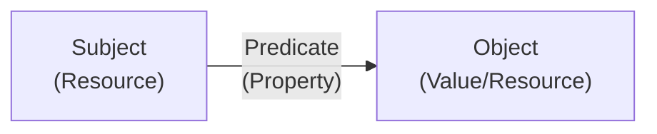
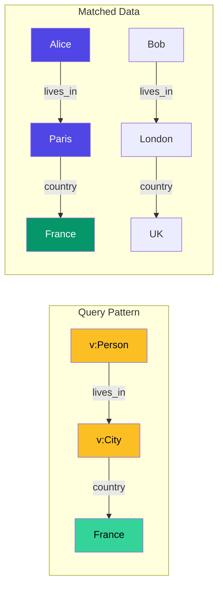

**Datalog** is a declarative query language derived from **Prolog** that excels at querying complex relationships in graph databases. Understanding what Datalog is starts with its foundation in **first-order logic** — specifically a subset called **Horn clauses** — which provides a flexible and powerful approach to handling multi-hop relationships that traditional query languages struggle with.

The Datalog query language offers a logical framework with clarity and simplicity that makes it ideal for:
- **Graph querying** — traversing relationships of arbitrary depth
- **Knowledge bases** — reasoning over facts and rules
- **Relational databases** — expressing complex joins elegantly

Unlike imperative query approaches, Datalog's foundation in declarative logical **predicates** and **variables** provides a more elegant and expressive way to query data. You define *what* constitutes a valid result, not *how* to compute it.

## Why Datalog?

Modern applications need to traverse complex relationships: social networks, organizational hierarchies, supply chains, and knowledge graphs. While SQL handles flat tables effectively, expressing queries like "find all ancestors" or "who knows someone who knows someone" requires verbose recursive Common Table Expressions that are difficult to write and maintain.

**Datalog makes these queries natural.** Instead of wrestling with procedural logic, you describe *what* you want to find, and the query engine determines *how* to find it.

Consider the difference:
- **SQL mindset**: "Join this table to that table, filter these rows, recurse until done"
- **Datalog mindset**: "Find all paths where A connects to B through any number of links"

### TerminusDB's Datalog Extensions

TerminusDB implements Datalog through **WOQL** (Web Object Query Language), which extends standard Datalog with practical features:

- **[Unification](/docs/unification-of-variables-in-datalog/)** — native support for matching and binding variables
- **[rdf:List](/docs/woql-rdflist-operations/)** — first-class support for ordered collections
- **Dictionary materialization** — transform query results into structured objects
- **[Fast set processing](/docs/woql-set-operations/)** — high performance difference, intersection and member matching of sets
- **Gradual binding** — predicates can both generate new values and match existing ones, like in Prolog
- **Lists** — enables aggregation (`group_by`) and disaggregation (`member`) operations
- **Dictionaries** — enables materialization of query results into structured objects and convert to/from JSON

## Core Concepts

### RDF: The Data Model

TerminusDB stores data using **RDF** (Resource Description Framework) — a W3C standard for representing information as a graph. Understanding RDF is helps understand how Datalog queries work in TerminusDB in the document graph.

In RDF, all data is expressed as **triples** — statements with three parts:
- **Subject** — the resource being described (a node in the graph)
- **Predicate** — the property or relationship type (the edge label)
- **Object** — the value or related resource (another node or a literal value)



For example, "Alice knows Bob" becomes the triple:
```
subject: person/alice
predicate: knows  
object: person/bob
```

This simple structure is surprisingly powerful — any data model can be expressed as a collection of triples, and complex relationships emerge naturally from connecting them.

### Predicates: The Building Blocks

Similar to its super-set Prolog, Datalog is based on **predicates**. Think of predicates as relations — similar to tables in SQL, but more flexible. Each predicate represents a relationship between entities.

In TerminusDB, the most fundamental predicate is `triple`, which directly queries the RDF data:

```
triple(Subject, Predicate, Object)
```

This reads as: "Find all RDF triples where the subject, predicate, and object match these patterns."

### Logical Variables

Queries use predicates with **logical variables** to represent unknowns — values we want the query engine to find for us. In WOQL, variables are prefixed with `v:`:

```javascript
triple("v:Person", "name", "v:Name")
```

This query asks: "Find all persons and their names." The variables `v:Person` and `v:Name` will be **bound** to all matching values in the database for each solution, what is expressed as a result "row" in the returned variable bindings.

### Solutions and Bindings

When you run a Datalog query, the engine returns **solutions** — each solution is a set of **bindings** that assign concrete values to your logical variables. By default, Datalog returns *all* solutions that satisfy the query, and it is even possible to stream each solution as it is found for progressive loading needs.

For example, if your database contains three people, the query above might return:

| v:Person | v:Name |
|----------|--------|
| `person/alice` | "Alice" |
| `person/bob` | "Bob" |
| `person/carol` | "Carol" |

Each row is one solution. The concrete values (like `person/alice`) are **URIs** (Uniform Resource Identifiers) — unique identifiers that reference specific nodes in the graph.

To limit results, use `limit`:

```javascript
limit(10, triple("v:Person", "name", "v:Name"))
```

This returns at most 10 solutions instead of all matches.

### Logical Connectives: Combining Predicates

Datalog uses **logical connectives** to combine predicates into complex queries:

- **`and`** (conjunction) — both conditions must be true. In WOQL, predicates listed together (separated by commas) are implicitly joined with `and`
- **`or`** (disjunction) — either condition can be true (gives separate solutions for all conditions evaluating to true)

```javascript
// Implicit AND - both must match
triple("v:Person", "type", "Employee"),
triple("v:Person", "department", "Engineering")

// Explicit OR - either can match  
or(
  triple("v:Person", "department", "Engineering"),
  triple("v:Person", "department", "Research")
)
```

### Unification: The Key Mechanism

When the same variable appears in multiple places, Datalog requires **identical values** at each occurrence for the query to be an accepted solution. This is called [unification](/docs/unification-of-variables-in-datalog/) — the process of finding values that satisfy all constraints simultaneously.

```javascript
triple("v:Person", "lives_in", "v:City"),
triple("v:City", "country", "France")
```

Here, `v:City` must be the same in both patterns. This single shared variable creates a **join** — finding all people who live in cities located in France. The variables can be scoped to a local part of the query to prevent them from leaking to the outer scope.



The diagram shows how the query pattern (top) matches against the data (bottom). Only Alice matches because Paris connects to France — Bob doesn't match because London connects to UK, not France.

## Datalog vs SQL: A Concrete Comparison

When comparing **Datalog vs SQL**, the difference becomes clear with recursive queries. Consider finding all ancestors of a person.

**SQL (Recursive CTE)**:
```sql
WITH RECURSIVE ancestors AS (
  SELECT parent_id, 1 as depth 
  FROM person 
  WHERE id = 'person_123'
  
  UNION ALL
  
  SELECT p.parent_id, a.depth + 1
  FROM person p
  INNER JOIN ancestors a ON p.id = a.parent_id
  WHERE a.depth < 10
)
SELECT * FROM ancestors;
```

**Datalog (WOQL)**:
```javascript
path("person_123", "(parent>)+", "v:Ancestor")
```

The Datalog version:
- **Expresses intent directly** — "find all ancestors via parent links"
- **Handles arbitrary depth** — no manual recursion limit needed
- **Is easier to read and maintain** — the query structure matches the mental model

### Why Datalog Excels

| Aspect | SQL | Datalog |
|--------|-----|---------|
| Recursive queries | Verbose CTEs | Native path expressions |
| Multi-hop joins | Explicit join chains | Shared variables |
| Graph traversal | Awkward, procedural | Natural, declarative |
| Query termination | Must manage manually | Guaranteed by design |

## Key Advantages

**Guaranteed Termination**: Variables in Datalog are restricted to finite **atomic values** — simple, indivisible data like strings, numbers, and URIs (as opposed to complex structures like nested objects). This design choice simplifies query optimization and guarantees that Datalog queries will terminate, even with recursive operations.

**Extended Capabilities in WOQL**: The finite atomic values restriction is relaxed in [WOQL](/docs/woql-explanation/) (the Web Object Query Language used in TerminusDB) to enable **lists** — useful for:
- **Aggregation** queries with `group_by` (collecting values into groups)
- **Disaggregation** queries with `member` (iterating over list elements)

TerminusDB retains the pure declarative quality of Datalog while adding these practical extensions.

**[Set Operations](/docs/woql-set-operations/)**: Advanced Datalog usage includes transformations with **set operators**:
- **`difference`** — elements in A but not in B
- **`intersection`** — elements in both A and B  
- **`union`** — elements in either A or B

This enables efficient work on both graph data and dynamic client-provided data simultaneously, [processing JSON records](/docs/extract-table-from-json-with-woql/) and [CSV files](/docs/compare-csv-values-with-woql/) alongside database queries.

## Datalog Query Examples: Progressive Complexity

Let's build understanding through progressively complex examples. Each example adds one new concept.

### Level 1: Retrieve All Edges

The `triple` predicate is the foundation of WOQL queries. It represents edges in the graph with three positions: subject (source), predicate (edge label), and object (target).

```javascript
triple("v:Subject", "v:Predicate", "v:Object")
```

This returns every edge in the graph. Variables prefixed with `v:` are logical variables that will be bound to all matching values. Every Subject is a URI (Uniform Resource Identifier) that references a node in the graph, every Predicate is a URI that references an edge label, and every Object is a URI that references a node in the graph or a Literal (string, number, boolean, free-form URI, unstructured JSON object, etc.).

### Level 2: Filter by Known Values

Constrain the query by replacing variables with concrete values:

```javascript
triple("v:Person", "rdf:type", "@schema:Employee"),
triple("v:Person", "department", "Department/Engineering")
```

This finds all employees in the Engineering department. The shared `v:Person` variable ensures both conditions apply to the same entity.


 The `@schema:` prefix indicates that the URI is a schema URI, which is a URI that references a node in the schema graph. The `Department/` prefix indicates that the URI is a Department URI, which is a URI for all Department documents, which in turn uses the default @base of the data repository.


### Level 3: Join Through Shared Variables

Connect multiple patterns by sharing variables:

```javascript
triple("v:Person", "works_at", "v:Company"),
triple("v:Company", "located_in", "v:City"),
triple("v:City", "country", "Country/France")
```

This datalog query finds all people who work at companies located in cities in France. The joins happen automatically through shared variables — no explicit JOIN syntax needed.


 The `Country/` prefix indicates that the URI is a Country URI, which is a URI for all structured Country documents which follow a particular structure (schema). They in turn uses the default @base of the data repository.


### Level 4: Two-Hop Traversal

Express multi-hop paths by chaining triples:

```javascript
triple("v:Person", "manages", "v:Middle"),
triple("v:Middle", "manages", "v:Report")
```

This finds all "skip-level" reporting relationships — people who manage someone who manages someone else.

### Level 5: Recursive Paths

For arbitrary-depth traversal, use the [`path` predicate](/docs/path-queries-in-woql/):

```javascript
path("ceo_jane", "(manages>)+", "v:Employee")
```

This finds everyone in the reporting chain under Jane, at any depth. The `+` means "one or more hops."

### Level 6: Capture the Path

Add a fourth parameter to capture which edges were traversed:

```javascript
path("ceo_jane", "(manages>)+", "v:Employee", "v:Chain")
```

Now `v:Chain` contains the sequence of management relationships, enabling analysis like "what's the longest reporting chain?"

### Level 7: Combine Patterns with Paths

Compose simple patterns with recursive paths:

```javascript
triple("v:Person", "department", "Sales"),
path("v:Person", "(knows>)+", "v:Contact"),
triple("v:Contact", "company", "v:TargetCompany")
```

This finds all companies reachable through the social network of Sales employees — useful for lead generation or relationship mapping.

## When to Use Datalog

### Datalog Excels For

| Use Case | Why Datalog Works |
|----------|-------------------|
| **Graph traversal** | Native path expressions handle arbitrary depth |
| **Recursive queries** | No manual recursion management needed |
| **Complex joins** | Shared variables express relationships naturally |
| **Knowledge graphs** | Logic-based reasoning over facts and rules |
| **Hierarchical data** | Org charts, taxonomies, bill-of-materials |
| **Network analysis** | Finding paths, cycles, connected components |

### Consider Alternatives When

| Situation | Better Choice |
|-----------|---------------|
| Simple CRUD operations | Standard TerminusDB REST Document APIs or SQL |
| Flat tabular data | SQL is well-optimized for this, works with TerminusDB too |
| Team unfamiliar with logic programming | SQL with good documentation |

### Datalog vs Other Graph Languages

**Cypher (Neo4j)**: Pattern-based like Datalog, but lacks the logical foundation. Datalog's unification provides more expressive power for complex constraints.

**SPARQL (RDF databases)**: Similar logical foundation to Datalog. While TerminusDB uses RDF as its data model, it currently uses WOQL rather than SPARQL as its query language, offering a more expressive Datalog-based approach.

**GraphQL**: Designed for API queries, not database queries. GraphQL fetches predetermined shapes; Datalog discovers patterns.

## Learn More About Datalog

Now that you understand what Datalog is and its advantages over SQL, explore these resources to deepen your knowledge of the Datalog query language:

### Core Datalog Concepts
- [Unification of Variables in Datalog](/docs/unification-of-variables-in-datalog/) — Deep dive into how logical variables work in Datalog
- [WOQL Explanation](/docs/woql-explanation/) — Understanding TerminusDB's Datalog-based query language
- [Path Queries](/docs/path-queries-in-woql/) — Recursive graph traversal with Datalog

### Datalog Programming Guides
- [WOQL Getting Started](/docs/woql-getting-started/) — Hands-on Datalog tutorial with examples
- [JavaScript WOQL Reference](/docs/javascript/) — Use Datalog queries in JavaScript
- [Python WOQL Reference](/docs/python/) — Implement Datalog queries with Python
- [Query with WOQL](/docs/how-to-query-with-woql/) — Practical Datalog querying guide

### Practical Datalog Applications
- [CSV Processing with Datalog](/docs/compare-csv-values-with-woql/) — Compare and process CSV data
- [JSON Processing](/docs/extract-table-from-json-with-woql/) — Extract structured data from JSON
- [Set Operations](/docs/woql-set-operations/) — Difference, intersection, and union operations
- [Documents in Knowledge Graphs](/docs/documents-explanation/) — Querying document structures
- [How-to Guides](/docs/use-the-clients/) — Real-world Datalog query examples

## Get Started

Ready to experience the power of declarative querying? 

1. **[Install TerminusDB](/docs/get-started-with-terminusdb/)** — Set up your environment
2. **[WOQL Getting Started Tutorial](/docs/woql-getting-started/)** — Write your first Datalog queries
3. **[Try the Examples](/docs/use-the-clients/)** — Learn from working code

Datalog offers a different way of thinking about data queries — one that matches how we naturally describe relationships. Once you understand what Datalog is and internalize the pattern of shared variables and logical constraints, you'll find complex queries become surprisingly simple to express.

## Terminology Glossary

Quick reference for key Datalog and WOQL terms:

| Term | Definition |
|------|------------|
| **Atomic value** | A simple, indivisible value like a string, number, or URI — not a nested structure |
| **Binding** | The assignment of a concrete value to a logical variable in a solution |
| **Declarative** | Describing *what* you want, not *how* to compute it |
| **First-order logic** | The mathematical foundation of Datalog, dealing with predicates and quantifiers |
| **Horn clause** | A specific form of logical statement that Datalog is based on |
| **IRI** | Internationalized Resource Identifier — like a URI but supports Unicode characters |
| **Literal** | A concrete data value in RDF (string, number, date) as opposed to a resource reference |
| **Logical connective** | Operators like `and` and `or` that combine predicates |
| **Logical variable** | A placeholder (prefixed with `v:` in WOQL) that gets bound to values |
| **Predicate** | A relation that can be true or false for given arguments (like `triple`) |
| **Prolog** | The logic programming language that Datalog is derived from |
| **RDF** | Resource Description Framework — the W3C standard data model used by TerminusDB |
| **rdf:List** | An RDF structure for representing ordered collections of items |
| **Solution** | A complete set of variable bindings that satisfies a query |
| **Triple** | The basic unit of RDF data: subject, predicate, object — representing a graph edge |
| **Unification** | The process of finding values that make two expressions identical |
| **URI** | Uniform Resource Identifier — a unique identifier for resources in the graph |
| **WOQL** | Web Object Query Language — TerminusDB's Datalog-based query language for RDF |